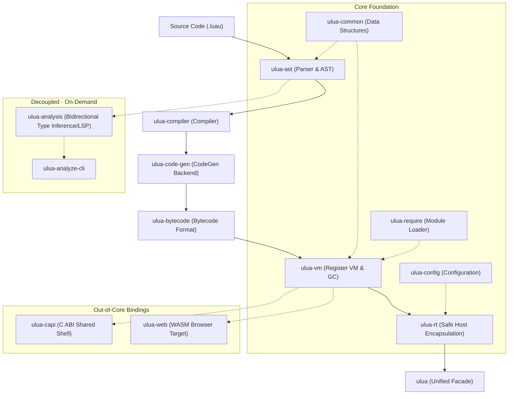

<a href="https://github.com/webc-site/ulua/blob/main/README.md#en"></a> <a href="https://github.com/webc-site/ulua/blob/main/readme/zh.md"></a>
<a href="https://webc-site.github.io/ulua/"></a>
<a href="https://github.com/webc-site/ulua"></a>
<a href="https://crates.io/crates/ulua"></a>

---

<a id="en"></a>

# ulua

ulua is a Rust implementation of [Luau](https://luau.org).
🎮 **Live Playground**: [webc-site.github.io/ulua](https://webc-site.github.io/ulua/) — Run and type-check Luau in your browser.

This project is a comprehensive refactor based on [luau-rs/luau](https://github.com/luau-rs/luau). Upstream [luau-rs/luau](https://github.com/luau-rs/luau) translated Roblox's original C++ implementation [luau-lang/luau](https://github.com/luau-lang/luau) into Rust.

Building upon that foundation, this project conducts a deep idiomatic refactor and codebase modernization:

- **Removed all `allow` attributes**: Eliminated all `#![allow(...)]` warning suppressions and resolved the underlying issues;
- **Rewritten in idiomatic Rust**: Replaced transliterated C-style code with idiomatic Rust patterns;
- **Clean Clippy checks**: Strictly adhered to Rust best practices to avoid and eliminate Clippy warnings;
- **Reduced `unsafe`**: Minimized `unsafe` blocks to shrink the trusted base and enhance memory safety.

- [Features Overview](#features-overview)
- [Usage Demonstration](#usage-demonstration)
  - [Direct Script & Bytecode Execution](#direct-script--bytecode-execution)
  - [JIT Native Acceleration & Switching](#jit-native-acceleration--switching)
  - [Rust Calling Lua Functions (Arguments & Multi-Return)](#rust-calling-lua-functions-arguments--multi-return)
  - [Lua Calling Rust Functions & Closures](#lua-calling-rust-functions--closures)
  - [Host Objects & UserData (Methods & Metamethods)](#host-objects--userdata-methods--metamethods)
  - [Static Type Checking](#static-type-checking)
- [Performance Benchmarks](#performance-benchmarks)
- [Key Features](#key-features)
- [Differences Between Luau and Lua](#differences-between-luau-and-lua)
- [Design Architecture & Execution Pipeline](#design-architecture-execution-pipeline)
  - [1. Core Execution Pipeline](#1-core-execution-pipeline)
- [Module Architecture](#module-architecture)
  - [1. Core Execution Engine (Core)](#1-core-execution-engine-core)
  - [2. Analysis & Bindings](#2-analysis-bindings)
  - [3. Command-Line Tools (CLI)](#3-command-line-tools-cli)
  - [4. Test Suites](#4-test-suites)
- [API Reference](#api-reference)
  - [Top-Level Helper Functions](#top-level-helper-functions)
  - [Procedural Macros](#procedural-macros)
  - [Core Runtime Types and Traits](#core-runtime-types-and-traits)

## Features Overview

ulua translates Roblox's Luau language directly from C++ into Rust without foreign function bindings or C toolchain dependencies.

The system encompasses the complete Luau pipeline: lexical analysis, AST parsing, bytecode compilation, register virtual machine execution, static bidirectional type inference, and native machine code generation.

In addition to faithful language execution, ulua delivers a safe high-level embedding layer designed for ergonomic Rust integration, offering memory safety, panic insulation, and WebAssembly compatibility.

## Usage Demonstration

### Direct Script & Bytecode Execution

Execute Luau code and run precompiled bytecode directly through high-level helper functions:

```rust
use ulua::{compile, eval, eval_bytecode};

fn main() -> Result<(), Box<dyn std::error::Error>> {
  // Directly evaluate source code
  eval("assert(1 + 1 == 2)")?;

  // Compile source code to raw binary bytecode
  let bytecode = compile("assert(10 * 20 == 200)")?;
  assert!(!bytecode.is_empty());

  // Directly execute precompiled bytecode
  eval_bytecode(&bytecode)?;

  Ok(())
}
```

### JIT Native Acceleration & Switching

`ulua` supports both **pure register virtual machine interpretation** and **pure Rust native machine code compilation (CodeGen JIT)**, with full switching capabilities in both CLI and Rust API:

#### 1. Rust API Control

After instantiating `Lua`, you can enable or disable native code generation at any time:

```rust
use ulua::prelude::*;

fn main() -> Result<()> {
  let lua = Lua::new();

  // 1. By default: pure interpretation (zero JIT) - instant startup, lightweight, and deterministic
  assert!(!lua.is_jit_enabled());
  lua.load("print('Running in Interpreter')").exec()?;

  // 2. Enable JIT native compilation (A64 / X64)
  lua.enable_jit(true)?;
  assert!(lua.is_jit_enabled());

  // Once enabled, code loaded with `lua.load(...)` compiles directly into native machine code
  let result: i64 = lua.load(r#"
    local sum = 0
    for i = 1, 1000000 do
      sum += i
    end
    return sum
  "#).eval()?;
  assert_eq!(result, 500000500000);

  // 3. Dynamically disable JIT to fall back to the interpreter at any time
  lua.enable_jit(false)?;
  assert!(!lua.is_jit_enabled());

  Ok(())
}
```

> [!NOTE]
> JIT native code generation supports Apple Silicon (AArch64) and x86_64 architectures. Enable it with `features = ["jit"]` (opt-in, not part of `ulua`'s default features).

#### 2. CLI Command-Line Control

Use the `--codegen` flag or environment variable to toggle JIT execution:

- **Interpreter (Default)**:
  ```bash
  ulua script.luau               # Pure interpretation
  ulua-repl-cli                  # Interactive REPL (interpreter mode)
  ```
- **JIT Native Acceleration**:
  ```bash
  ulua --codegen script.luau     # A64/X64 JIT compilation and execution
  ulua-repl-cli --codegen        # Interactive REPL (JIT mode)
  LUAU_CODEGEN=1 ulua script.luau # Enable via environment variable
  ```

#### 3. JIT Control Comparison with Major Lua Runtimes

| Runtime / Library         | Enable JIT                               | Disable JIT (Pure Interpretation)              |
| :------------------------ | :--------------------------------------- | :--------------------------------------------- |
| **`ulua` (This Project)** | `lua.enable_jit(true)` / CLI `--codegen` | `lua.enable_jit(false)` / Default without flag |
| **`mlua` (Luau C++)**     | `lua.enable_jit(true)`                   | `lua.enable_jit(false)`                        |
| **LuaJIT 2.1**            | `jit.on()` / CLI `-jon`                  | `jit.off()` / CLI `-joff`                      |

### Rust Calling Lua Functions (Arguments & Multi-Return)

Obtain function handles ([`Function`]) from the script environment, supporting single values, multi-argument tuples, multiple return values, and collections ([`Vec`]):

```rust
use ulua::prelude::*;

fn main() -> Result<()> {
  let lua = Lua::new();

  // 1. Define Lua function and retrieve handle in Rust
  lua
    .load(
      r#"
        function div_rem(n, d)
          return math.floor(n / d), n % d
        end
      "#,
    )
    .exec()?;

  let div_rem: Function = lua.globals().get("div_rem")?;

  // 2. Multi-argument passing and multi-return reception (Tuple <-> Lua Multi-Return)
  let (quotient, remainder): (i64, i64) = div_rem.call((17, 5))?;
  assert_eq!((quotient, remainder), (3, 2));

  // 3. Passing collections: Rust Vec automatically maps to Lua sequence tables
  let sum: Function = lua
    .load(
      r#"
        function(nums)
          local total = 0
          for _, n in ipairs(nums) do total += n end
          return total
        end
      "#,
    )
    .eval()?;

  let total: i64 = sum.call(vec![10, 20, 30])?;
  assert_eq!(total, 60);

  Ok(())
}
```

### Lua Calling Rust Functions & Closures

Inject Rust native functions and stateful closures into the script environment, supporting parameter unpacking, multiple return values, state capture, and error insulation:

```rust
use std::sync::{
  Arc,
  atomic::{AtomicI64, Ordering},
};
use ulua::prelude::*;

fn main() -> Result<()> {
  let lua = Lua::new();

  // 1. Register Rust function: unpack multiple arguments and return multiple values
  let split = lua.create_function(|_, (s, sep): (String, String)| {
    let (left, right) = s.split_once(&sep).unwrap_or((&s, ""));
    Ok((left.to_string(), right.to_string()))
  })?;
  lua.globals().set("split", split)?;

  let (a, b): (String, String) = lua.load(r#"split("hello:world", ":")"#).eval()?;
  assert_eq!((a.as_str(), b.as_str()), ("hello", "world"));

  // 2. Stateful closure capturing environment
  let counter = Arc::new(AtomicI64::new(0));
  let c = counter.clone();
  let next_id = lua.create_function(move |_, ()| Ok(c.fetch_add(1, Ordering::SeqCst) + 1))?;
  lua.globals().set("next_id", next_id)?;

  lua.load("next_id(); next_id()").exec()?;
  assert_eq!(counter.load(Ordering::SeqCst), 2);

  // 3. Cross-language error propagation: Rust Err surfaces as Lua error caught by pcall
  let safe_div = lua.create_function(|_, (a, b): (f64, f64)| {
    if b == 0.0 {
      return Err(Error::runtime("division by zero"));
    }
    Ok(a / b)
  })?;
  lua.globals().set("safe_div", safe_div)?;

  let (ok, err_msg): (bool, String) = lua
    .load(
      r#"
        local ok, res = pcall(safe_div, 1, 0)
        return ok, tostring(res)
      "#,
    )
    .eval()?;
  assert!(!ok);
  assert!(err_msg.contains("division by zero"));

  Ok(())
}
```

### Host Objects & UserData (Methods & Metamethods)

Bind native Rust structs to the script environment, exposing immutable (`&this`), mutable (`&mut this`), and operator metamethods:

```rust
use ulua::prelude::*;

struct Player {
  name: String,
  score: i64,
}

impl UserData for Player {
  fn add_methods<M: UserDataMethods<Self>>(methods: &mut M) {
    // Read-only method
    methods.add_method("get_score", |_, this, ()| Ok(this.score));

    // In-place mutation method
    methods.add_method_mut("add_score", |_, this, points: i64| {
      this.score += points;
      Ok(())
    });

    // Metamethod overload (e.g. __tostring)
    methods.add_meta_method("__tostring", |_, this, ()| {
      Ok(format!("Player({}, score={})", this.name, this.score))
    });
  }
}

fn main() -> Result<()> {
  let lua = Lua::new();

  let player = lua.create_userdata(Player {
    name: "Player1".to_string(),
    score: 100,
  })?;
  lua.globals().set("player", player)?;

  lua.load("player:add_score(50)").exec()?;
  let final_score: i64 = lua.load("return player:get_score()").eval()?;
  assert_eq!(final_score, 150);

  let repr: String = lua.load("return tostring(player)").eval()?;
  assert_eq!(repr, "Player(Player1, score=150)");

  Ok(())
}
```

### Static Type Checking

Perform static type analysis ahead of runtime execution:

```rust
use ulua::{check, check_with_definitions};

fn main() {
  let valid_script = "local total: number = 42";
  assert!(check(valid_script).is_ok());

  let host_script = "local res = add(10, 20)";
  let defs = "declare function add(a: number, b: number): number";
  assert!(check_with_definitions(host_script, defs).is_ok());
}
```

## Performance Benchmarks

`ulua` matches official C++ Luau throughput in pure interpretation (zero JIT), while unleashing the extreme speed of native machine code generation when JIT is enabled.

Benchmarks are performed using an in-memory pure Rust harness (eliminating child process spawn overhead and terminal I/O latency), evaluating 8 compute-heavy algorithms (recursive Fibonacci, N-Body celestial mechanics, Mandelbrot fractals, matrix multiplication, quicksort, mass string concatenation, binary tree allocation, and Spectral Norm) with multiple iterations to compute medians on Apple Silicon (arm64).


> [!TIP]
> Run `./bench.sh` to reproduce the benchmarks and regenerate the chart locally.

## Key Features

- Pure Rust Implementation: Zero C/C++ compilation toolchains or external system libraries required; runs on standard targets and WebAssembly environments.
- Safe High-Level Ergonomics: Familiar resource-managed handles for state management, tables, functions, and userdata with automatic cleanup.
- Static Type Verification: Integrated bidirectional type inference engine supporting declaration files and structured error diagnostics.
- Robust Panic Insulation: Translates Rust panics and errors across callback boundaries into catchable Luau runtime errors without unwinding aborts.
- Compile-Time Macro Validation: Syntax and type verification of embedded scripts and module dependencies during Rust compilation via procedural macros.
- Asynchronous Runtime Integration: Cooperative Luau coroutines integrate with Rust futures and streams alongside Serde serialization.

## Differences Between Luau and Lua

[Luau](https://luau.org) originates from Roblox's extensive evolution and modernization of Lua 5.1. While maintaining backwards compatibility with Lua 5.1 syntax, Luau is heavily re-engineered for high concurrency, game engine performance, large-scale software engineering, and strict sandboxing.

Key distinctions include:

### 1. Gradual Static Type System

Vanilla Lua is entirely dynamically typed; Luau provides an industrial-grade bidirectional gradual type system and static analysis suite:

- **Type Annotations & Signatures**: Supports explicit static type annotations on variables, function parameters, and return types (e.g. `local x: number = 42`, `function add(a: number, b: number): number`).
- **Rich Type Modeling**: Built-in type aliases (`type Point = { x: number, y: number }`), generics (`type List<T> = { [number]: T }`), union types (`number | string`), intersection types (`A & B`), and optional types (`T?`).
- **Cross-Module Type Export**: Enables `export type` across modules via `require`, delivering end-to-end type contracts across large codebases.
- **Static Analysis & LSP**: Complete subtype constraint solver and language server protocol (LSP) providing diagnostics, hover tooltips, and autocompletion before runtime.

### 2. Modern Syntax Ergonomics

Building upon Lua 5.1 baseline syntax, Luau incorporates modern language features:

- **String Interpolation**: Backtick template syntax `` `Hello, {name}!` `` with embedded expressions, eliminating verbose `string.format` calls.
- **Compound Assignment**: `+=`, `-=`, `*=`, `/=`, `//=`, `%=`, `^=`, `..=`, with single evaluation of the left-hand side (e.g. `t[func()] += 1`).
- **`continue` Control Flow**: Native `continue` keyword in `for`, `while`, and `repeat` loops (contextual keyword, preserving backwards compatibility).
- **`const` Local Bindings**: `const x = 1` prevents variable rebinding, protecting local invariants.
- **`if-then-else` Expressions**: Ternary-style condition expressions `local val = if cond then a else b`, avoiding the insidious pitfalls of Lua's `cond and a or b` idiom when `a` is false.
- **Generalized Iteration**: Iterate over tables directly with `for k, v in t do` without needing `pairs` or `ipairs`; extensible via the `__iter` metamethod.
- **Literal Enhancements**: Binary literals (`0b0101`), hexadecimal literals (`0xABC`), and numeric underscore separators (`1_000_000`).

### 3. Standard Library & Data Structures

- **Immutable Table Freezing**: `table.freeze(t)` and `table.isfrozen(t)` provide first-class read-only tables for tamper-proofing and data safety.
- **Optimized Table Allocation**: `table.create(size, [val])` preallocates array capacity to avoid incremental resizing; adds `table.find`, `table.move`, and `table.clear`.
- **Native Buffer Memory**: The `buffer` library offers fast, contiguous byte buffers with zero-copy read/write operations (`buffer.create`, `buffer.readu8`, `buffer.writef32`, etc.).
- **Built-in Vector3**: Native 3-wide SIMD vector primitive type optimized for 3D mathematics and spatial calculations.
- **VM-Level Fastcall Builtins**: The `math` and `bit32` libraries are compiled into specialized VM opcodes (Fastcalls) rather than costly function dispatch frames.

### 4. Intentional Deviations & Design Trade-offs

Luau is not a blind superset of Lua 5.x, but makes deliberate architectural trade-offs:

- **Unified Number Representation**: Preserves a single 64-bit IEEE 754 double precision float (exact integer representation up to $2^{53}$), deliberately omitting Lua 5.3's integer/float bifurcation to eliminate undefined overflow semantics and optimize JIT compilation.
- **Hardened Sandboxing**: Strips unsandboxed `io`, OS command execution (`os.execute`), dynamic library loading (`package`), and dangerous `debug` inspection hooks from the base environment.
- **No Tail Call Elimination**: Disallows tail calls by design to maintain predictable, faithful debug stack traces and enable deep caller authentication.
- **Structured Control Flow**: Rejects `goto` statements and Lua 5.4's `<close>` variables to maintain predictable control flow and compact compiler passes; tables omit `__gc` finalizers to eliminate destructor re-entrancy and GC stalls.

## Design Architecture & Execution Pipeline

### 1. Core Execution Pipeline

The Luau runtime is dynamically typed; **the core compilation and VM execution pipeline relies on type erasure and is completely decoupled from static type analysis**:



- **Lexical & Syntax Parsing (`ulua-ast`)**: Converts source code into an arena-allocated abstract syntax tree.
- **Bytecode Compilation & Optimization (`ulua-compiler` + `ulua-code-gen` + `ulua-bytecode`)**:
  Applies constant folding, liveness analysis, and register allocation to generate compact bytecode instructions.
- **Register VM Execution (`ulua-vm`)**:
  Loads bytecode streams and drives register-based dispatch with generational garbage collection and built-in standard libraries.
- **Safe Host Runtime (`ulua-rt`)**:
  Provides ergonomic RAII handles (`Lua`, `Table`, `Function`, `UserData`), managing references, lifetimes, and panic boundaries.
- **Architectural Decoupling**:
  - **Core Packages**: Minimal, robust execution engine with zero redundant dependencies and minimal unsafe footprint.
  - **`ulua-analysis`**: Dedicated offline static type checker and LSP language server (completion, hover, go-to-definition, linting); completely optional at runtime.
  - **`ulua-capi` / `ulua-web`**: Boundary wrappers exporting C ABI symbols and WebAssembly bindings.

## Module Architecture

Target Standard: Luau 0.737 compatible specification.

### 1. Core Execution Engine (Core)

- `ulua`: Unified umbrella entry point providing top-level APIs.
- `ulua-ast`: Lexer, parser, arena memory allocator, and AST definitions.
- `ulua-compiler`: Bytecode compiler and multi-pass optimizer.
- `ulua-code-gen`: Low-level bytecode generation and platform backend.
- `ulua-bytecode`: Instruction definitions, bytecode packaging, serialization, and decoding.
- `ulua-vm`: Register-based virtual machine, garbage collector, and standard libraries.
- `ulua-rt`: Ergonomic safe runtime abstractions, UserData binding, and panic protection.
- `ulua-common`: Cross-module utilities, DenseHashTable, SBO vectors, and FastFlags.
- `ulua-config`: Hierarchical `.luau.toml` configuration parser.
- `ulua-require`: String-based module resolution and alias resolution.
- `ulua-checked-macros`: Compile-time syntax/type verification procedural macros.
- `ulua-rt-derive`: Derive procedural macros for `UserData` and `FromLua`.

### 2. Analysis & Bindings

- `ulua-analysis`: Bidirectional static type inference, constraint solver, subtyping engine, and LSP language server support (offline/development tooling, not required for execution).
- `ulua-capi`: Pure C ABI symbol export shell for dynamic linking from C/C++.
- `ulua-web`: WebAssembly browser environment integration for web execution and playgrounds.

### 3. Command-Line Tools (CLI)

- `ulua-repl-cli`: Interactive REPL command-line terminal.
- `ulua-analyze-cli`: Static type analysis and syntax diagnostics CLI.
- `ulua-compile-cli`: Standalone bytecode compiler binary.
- `ulua-bytecode-cli`: Bytecode disassembler and inspection tool.
- `ulua-ast-cli`: Abstract syntax tree inspector.
- `ulua-reduce-cli`: Luau code test-case reduction tool.
- `ulua-cli-lib`: Shared foundation for CLI binaries.

### 4. Test Suites

- `ulua-unit-test`: Upstream unit test suite translated from C++.
- `ulua-conformance`: Upstream specification conformance and behavioral test suite.
- `ulua-cli-test`: End-to-end integration test runner for CLI binaries.
- `ulua-e2e`: Comprehensive end-to-end integration tests.

## API Reference

### Top-Level Helper Functions

- `compile(source: &str) -> Result<Vec<u8>, Error>`: Compiles Luau source code into raw bytecode bytes.
- `eval(source: &str) -> Result<(), Error>`: Instantiates an isolated VM state, loads the standard library, executes code, and returns execution status.
- `eval_bytecode(bytecode: &[u8]) -> Result<(), Error>`: Instantiates an isolated VM state, loads the standard library, directly executes precompiled bytecode, and returns execution status.
- `check(source: &str) -> Result<(), Vec<TypeDiagnostic>>`: Performs static type checking and returns diagnostics on failure.
- `check_with_definitions(source: &str, defs: &str) -> Result<(), Vec<TypeDiagnostic>>`: Validates source against external declaration definitions.
- `check_modules(...)` / `check_modules_with_definitions(...)`: Validates multiple interconnected scripts across a module dependency tree.

### Procedural Macros

- `ulua!`: Validates embedded script syntax and type correctness during Rust compilation.
- `ulua_file!`: Validates filesystem script files and dependency graphs at compile time.

### Core Runtime Types and Traits

- `Lua`: Primary virtual machine handle governing state lifecycle, global environments, and resource creation, providing `load` (source) and `load_bytecode` (precompiled bytecode) loaders, with `enable_jit(bool)` and `is_jit_enabled()` to dynamically toggle native JIT execution.
- `Table`: Luau table handle providing key-value access, iteration, and array sequence operations.
- `Function`: Executable function reference supporting invocation with variable argument and return types.
- `UserData`: Trait enabling Rust structs to be passed to and manipulated by Luau scripts.
- `UserDataMethods`: Method builder for registering immutable, mutable, and meta-methods on custom userdata.
- `Value`: Dynamic enum representing all valid Luau value variants.
- `Chunk`: Execution wrapper for scripts and precompiled bytecode supporting evaluation, execution, and type checking.
- `FromLua` / `IntoLua`: Conversion traits for bidirectional data marshaling between Rust and Luau.
- `TypeDiagnostic`: Structured diagnostic item indicating line, column, and description of static type violations.
- `Error` / `Result`: Unified error types encompassing syntax, runtime, memory, and type failure states.
