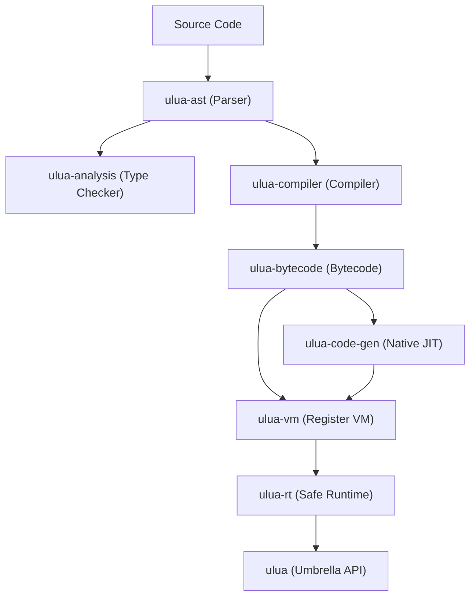

# ulua

ulua is a Rust implementation of [Luau](https://luau.org).

This project is a comprehensive refactor based on [luau-rs/luau](https://github.com/luau-rs/luau). Upstream [luau-rs/luau](https://github.com/luau-rs/luau) translated Roblox's original C++ implementation [luau-lang/luau](https://github.com/luau-lang/luau) into Rust.

Building upon that foundation, this project conducts a deep idiomatic refactor and codebase modernization:
- **Removed all `allow` attributes**: Eliminated all `#![allow(...)]` warning suppressions and resolved the underlying issues;
- **Rewritten in idiomatic Rust**: Replaced transliterated C-style code with idiomatic Rust patterns;
- **Clean Clippy checks**: Strictly adhered to Rust best practices to avoid and eliminate Clippy warnings;
- **Reduced `unsafe`**: Minimized `unsafe` blocks to shrink the trusted base and enhance memory safety.

## Features Overview

ulua translates Roblox's Luau language directly from C++ into Rust without foreign function bindings or C toolchain dependencies.

The system encompasses the complete Luau pipeline: lexical analysis, AST parsing, bytecode compilation, register virtual machine execution, static bidirectional type inference, and native machine code generation.

In addition to faithful language execution, ulua delivers a safe high-level embedding layer designed for ergonomic Rust integration, offering memory safety, panic insulation, and WebAssembly compatibility.

## Usage Demonstration

### Direct Script Execution

Execute Luau code directly through high-level helper functions:

```rust
use ulua::{compile, eval};

fn main() -> Result<(), Box<dyn std::error::Error>> {
  eval("assert(1 + 1 == 2)")?;

  let bytecode = compile("return 10 * 20")?;
  assert!(!bytecode.is_empty());

  Ok(())
}
```

### Static Type Checking

Perform static type analysis ahead of runtime execution:

```rust
use ulua::{check, check_with_definitions};

fn main() {
  let valid_script = "local total: number = 42";
  assert!(check(valid_script).is_ok());

  let host_script = "local res = add(10, 20)";
  let defs = "declare function add(a: number, b: number): number";
  assert!(check_with_definitions(host_script, defs).is_ok());
}
```

### High-Level Host Embedding

Bind Rust data types, closures, and methods to the Luau environment:

```rust
use ulua::prelude::*;

struct Player {
  name: String,
  score: i64,
}

impl UserData for Player {
  fn add_methods<M: UserDataMethods<Self>>(methods: &mut M) {
    methods.add_method("get_score", |_, this, ()| Ok(this.score));
    methods.add_method_mut("add_score", |_, this, points: i64| {
      this.score += points;
      Ok(())
    });
  }
}

fn main() -> Result<()> {
  let lua = Lua::new();

  lua.globals().set("multiplier", 2i64)?;

  let calc = lua.create_function(|_, (a, b): (i64, i64)| Ok((a + b) * 2))?;
  lua.globals().set("calc", calc)?;

  let res: i64 = lua.load("return calc(3, 4)").eval()?;
  assert_eq!(res, 14);

  let player = lua.create_userdata(Player {
    name: "Player1".to_string(),
    score: 100,
  })?;
  lua.globals().set("player", player)?;

  lua.load("player:add_score(50)").exec()?;
  let final_score: i64 = lua.load("return player:get_score()").eval()?;
  assert_eq!(final_score, 150);

  Ok(())
}
```

## Key Features

- Pure Rust Implementation: Zero C/C++ compilation toolchains or external system libraries required; runs on standard targets and WebAssembly environments.
- Safe High-Level Ergonomics: Familiar resource-managed handles for state management, tables, functions, and userdata with automatic cleanup.
- Static Type Verification: Integrated bidirectional type inference engine supporting declaration files and structured error diagnostics.
- Robust Panic Insulation: Translates Rust panics and errors across callback boundaries into catchable Luau runtime errors without unwinding aborts.
- Compile-Time Macro Validation: Syntax and type verification of embedded scripts and module dependencies during Rust compilation via procedural macros.
- Asynchronous Runtime Integration: Cooperative Luau coroutines integrate with Rust futures and streams alongside Serde serialization.

## Design Architecture

Execution flows through distinct specialized modules:



The parsing subsystem translates source code into memory-arena AST structures.

The type checker traverses the AST to validate contracts and infer types against global or local definitions.

The compiler generates bytecode instructions, applying constant folding and register allocation optimizations.

The register VM loads and executes bytecode streams with generational garbage collection and standard library bindings.

The high-level runtime wraps VM instances with safe handle types, lifetime management, and automatic type conversion.

## Tech Stack

- Language: Rust 2024 edition.
- Target Standard: Luau 0.737 compatible specification.
- Architecture Layers:
  - `ulua-ast`: Lexer, parser, arena memory allocation, syntax tree definitions.
  - `ulua-compiler`: Bytecode compilation and bytecode optimizer passes.
  - `ulua-bytecode`: Opcode definition, serialization, and decoding.
  - `ulua-vm`: Register-based execution engine, memory allocator, garbage collector, and standard library.
  - `ulua-analysis`: Bidirectional type inference, constraint solver, and subtyping logic.
  - `ulua-code-gen`: Assembly instruction generator for AArch64 and x86-64 platforms.
  - `ulua-rt`: High-level runtime encapsulation, userdata mapping, and error bridging.
  - `ulua-config`: Configuration parser for directory-level Luau options.
  - `ulua-require`: Modular path and alias resolution for string-based imports.
- Key Ecosystem Crates:
  - `wasm-bindgen`: WebAssembly browser target binding.
  - `rustyline`: Interactive REPL line editor.
  - `serde`: Value serialization and deserialization.

## Directory Structure

```
ulua/
├── crates/
│   ├── ulua/                  # Umbrella facade crate
│   ├── ulua-analysis/         # Static type checking system
│   ├── ulua-analyze-cli/      # Type checker command-line binary
│   ├── ulua-ast/              # Lexer and parser implementation
│   ├── ulua-ast-cli/          # AST inspection utility
│   ├── ulua-bytecode/         # Bytecode encoder and format definitions
│   ├── ulua-bytecode-cli/     # Bytecode dumper utility
│   ├── ulua-cli-lib/          # Shared command-line foundation
│   ├── ulua-cli-test/         # CLI integration test suite
│   ├── ulua-code-gen/         # Native code generation backend
│   ├── ulua-common/           # Core shared utilities and FastFlags
│   ├── ulua-compile-cli/      # Standalone compiler binary
│   ├── ulua-compiler/         # Bytecode compiler and optimizer
│   ├── ulua-config/           # Configuration parsing library
│   ├── ulua-conformance/      # Upstream conformance test runner
│   ├── ulua-e2e/              # End-to-end test framework
│   ├── ulua-reduce-cli/       # Code reduction utility
│   ├── ulua-repl-cli/         # Interactive REPL binary
│   ├── ulua-require/          # String-based module resolution
│   ├── ulua-rt/               # High-level ergonomic runtime
│   ├── ulua-checked-macros/   # Compile-time verification procedural macros
│   ├── ulua-rt-derive/        # Derive macros for UserData and FromLua
│   ├── ulua-unit-test/        # Upstream unit test translations
│   ├── ulua-vm/               # Register VM and standard libraries
│   └── ulua-web/              # WebAssembly browser integration
├── examples/                  # Standalone usage example projects
├── cpp/                       # Upstream Luau C++ submodule
├── docs/                      # Architectural specifications and documents
└── readme/                    # Bilingual documentation sources
```

## API Reference

### Top-Level Helper Functions

- `compile(source: &str) -> Result<Vec<u8>, String>`: Compiles Luau source code into raw bytecode bytes.
- `eval(source: &str) -> Result<(), String>`: Instantiates an isolated VM state, loads the standard library, executes code, and returns execution status.
- `check(source: &str) -> Result<(), Vec<TypeDiagnostic>>`: Performs static type checking and returns diagnostics on failure.
- `check_with_definitions(source: &str, defs: &str) -> Result<(), Vec<TypeDiagnostic>>`: Validates source against external declaration definitions.
- `check_modules(...)` / `check_modules_with_definitions(...)`: Validates multiple interconnected scripts across a module dependency tree.

### Procedural Macros

- `ulua!`: Validates embedded script syntax and type correctness during Rust compilation.
- `ulua_file!`: Validates filesystem script files and dependency graphs at compile time.

### Core Runtime Types and Traits

- `Lua`: Primary virtual machine handle governing state lifecycle, global environments, and resource creation.
- `Table`: Luau table handle providing key-value access, iteration, and array sequence operations.
- `Function`: Executable function reference supporting invocation with variable argument and return types.
- `UserData`: Trait enabling Rust structs to be passed to and manipulated by Luau scripts.
- `UserDataMethods`: Method builder for registering immutable, mutable, and meta-methods on custom userdata.
- `Value`: Dynamic enum representing all valid Luau value variants.
- `Chunk`: Execution wrapper for scripts supporting evaluation, execution, and type checking.
- `FromLua` / `IntoLua`: Conversion traits for bidirectional data marshaling between Rust and Luau.
- `TypeDiagnostic`: Structured diagnostic item indicating line, column, and description of static type violations.
- `Error` / `Result`: Unified error types encompassing syntax, runtime, memory, and type failure states.
