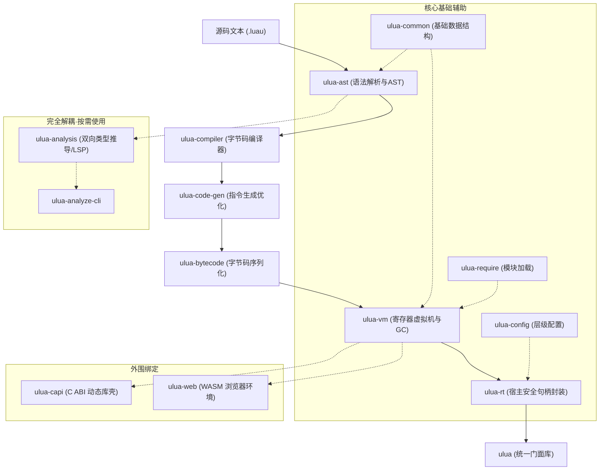

<a href="https://github.com/webc-site/ulua/blob/main/README.md#en"></a> <a href="https://github.com/webc-site/ulua/blob/main/readme/zh.md"></a>
<a href="https://webc-site.github.io/ulua/"></a>
<a href="https://github.com/webc-site/ulua"></a>
<a href="https://crates.io/crates/ulua"></a>

---

# ulua

ulua 是 [Luau](https://luau.org) 的 Rust 实现。
🎮 **在线体验**：[webc-site.github.io/ulua](https://webc-site.github.io/ulua/) —— 在浏览器中即时运行与类型检查 Luau。

本项目是基于 [luau-rs/luau](https://github.com/luau-rs/luau) 的全面重构。上游 [luau-rs/luau](https://github.com/luau-rs/luau) 将 Roblox 的 C++ 源码 [luau-lang/luau](https://github.com/luau-lang/luau) 转写为了 Rust。

在此基础上，本项目进行了深度重构与代码现代化：

- **删除所有 `allow`**：彻底清理所有编译警告忽略属性（`#![allow(...)]`），直面并解决潜在隐患；
- **Rust 惯用化重写**：用纯正的 Rust 方式改写 C 风格代码；
- **消除 Clippy 告警**：遵循严格规范，全面避免并修复 Clippy 报警；
- **精简 `unsafe`**：大幅减少 `unsafe` 代码块，持续强化内存安全。

- [项目功能介绍](#项目功能介绍)
- [使用演示](#使用演示)
  - [基础脚本与字节码执行](#基础脚本与字节码执行)
  - [即时编译与解释执行切换](#即时编译与解释执行切换)
  - [Rust 调用 Lua 函数（参数传递与多返回值）](#rust-调用-lua-函数参数传递与多返回值)
  - [Lua 调用 Rust 函数与闭包](#lua-调用-rust-函数与闭包)
  - [宿主对象与面向对象 (UserData)](#宿主对象与面向对象-userdata)
  - [静态类型检查](#静态类型检查)
- [性能基准评测](#性能基准评测)
- [特性介绍](#特性介绍)
- [Luau 与 Lua 的区别](#luau-与-lua-的区别)
- [设计思路与核心执行流程](#设计思路与核心执行流程)
  - [1. 核心执行闭环](#1-核心执行闭环)
- [模块划分](#模块划分)
  - [1. 核心执行引擎](#1-核心执行引擎)
  - [2. 分析与绑定](#2-分析与绑定)
  - [3. 命令行工具](#3-命令行工具)
  - [4. 测试套件](#4-测试套件)
- [API 说明](#api-说明)
  - [顶层辅助函数](#顶层辅助函数)
  - [过程宏](#过程宏)
  - [核心运行时类型与特征](#核心运行时类型与特征)

## 项目功能介绍

ulua 将 Luau 语言由 C++ 直接转译至 Rust，无需外部动态链接库绑定或 C 语言编译环境。

项目覆盖完整的语言处理管线：词法分析、语法解析、字节码编译、寄存器虚拟机执行、双向静态类型推导以及底层机器码生成。

除提供语义对齐的底层执行引擎外，ulua 实现了安全易用且内存受控的高阶宿主嵌入层，支持跨语言生命周期管理、恐慌隔离与浏览器端 WebAssembly 运行环境。

## 使用演示

### 基础脚本与字节码执行

通过全局便捷函数快速执行脚本、编译源码为二进制字节码并直接运行：

```rust
use ulua::{compile, eval, eval_bytecode};

fn main() -> Result<(), Box<dyn std::error::Error>> {
  // 直接执行源码
  eval("assert(1 + 1 == 2)")?;

  // 编译源码为二进制字节码
  let bytecode = compile("assert(10 * 20 == 200)")?;
  assert!(!bytecode.is_empty());

  // 直接执行预编译字节码
  eval_bytecode(&bytecode)?;

  Ok(())
}
```

### 即时编译与解释执行切换

`ulua` 同时支持**寄存器虚拟机解释执行**与**纯 Rust 本地机器码即时编译 (CodeGen JIT)**，支持在命令行与 Rust API 中自由切换：

#### 1. Rust API 控制

在创建 `Lua` 实例后，可随时通过 `enable_jit` 开启或关闭本地机器码生成：

```rust
use ulua::prelude::*;

fn main() -> Result<()> {
  let lua = Lua::new();

  // 1. 默认情况下：解释执行，启动极快、轻量且具备确定性内存行为
  assert!(!lua.is_jit_enabled());
  lua.load("print('Running in Interpreter')").exec()?;

  // 2. 启用即时编译加速 (A64 / X64)
  lua.enable_jit(true)?;
  assert!(lua.is_jit_enabled());

  // 启用后，load 加载的脚本将自动编译为宿主本地机器指令并执行
  let result: i64 = lua.load(r#"
    local sum = 0
    for i = 1, 1000000 do
      sum += i
    end
    return sum
  "#).eval()?;
  assert_eq!(result, 500000500000);

  // 3. 亦可随时动态关闭 JIT 回退到解释执行
  lua.enable_jit(false)?;
  assert!(!lua.is_jit_enabled());

  Ok(())
}
```

> [!NOTE]
> 即时编译本地机器码生成支持 Apple Silicon (AArch64) 与 x86_64 架构。使用时需开启 `features = ["jit"]`（opt-in,非 `ulua` 默认 feature）.

#### 2. CLI 命令行控制

在命令行终端中，通过 `--codegen` 开关或环境变量启用 JIT：

- **解释执行（默认）**：
  ```bash
  ulua script.luau               # 解释执行
  ulua-repl-cli                  # 交互式 REPL (解释模式)
  ```
- **即时编译**：
  ```bash
  ulua --codegen script.luau     # 启用 A64/X64 JIT 编译执行
  ulua-repl-cli --codegen        # 交互式 REPL (JIT 模式)
  LUAU_CODEGEN=1 ulua script.luau # 通过环境变量启用 JIT
  ```

#### 3. 与主流 Lua 运行时的 JIT 开关对照

| 运行时 / 库           | 开启 JIT                                 | 关闭 JIT (解释执行)                    |
| :-------------------- | :--------------------------------------- | :------------------------------------- |
| **`ulua` (本项目)**   | `lua.enable_jit(true)` / CLI `--codegen` | `lua.enable_jit(false)` / 默认不带参数 |
| **`mlua` (Luau C++)** | `lua.enable_jit(true)`                   | `lua.enable_jit(false)`                |
| **LuaJIT 2.1**        | `jit.on()` / CLI `-jon`                  | `jit.off()` / CLI `-joff`              |

### Rust 调用 Lua 函数（参数传递与多返回值）

从环境获取函数句柄（[`Function`]），支持单值、多参数元组、多返回值接收及复合集合（[`Vec`]）传递：

```rust
use ulua::prelude::*;

fn main() -> Result<()> {
  let lua = Lua::new();

  // 1. 定义 Lua 函数并由 Rust 获取句柄
  lua
    .load(
      r#"
        function div_rem(n, d)
          return math.floor(n / d), n % d
        end
      "#,
    )
    .exec()?;

  let div_rem: Function = lua.globals().get("div_rem")?;

  // 2. 多参数传递与多返回值接收 (Tuple <-> Lua Multi-Return)
  let (quotient, remainder): (i64, i64) = div_rem.call((17, 5))?;
  assert_eq!((quotient, remainder), (3, 2));

  // 3. 传递复合数据：Rust Vec 自动映射为 Lua 序列表
  let sum: Function = lua
    .load(
      r#"
        function(nums)
          local total = 0
          for _, n in ipairs(nums) do total += n end
          return total
        end
      "#,
    )
    .eval()?;

  let total: i64 = sum.call(vec![10, 20, 30])?;
  assert_eq!(total, 60);

  Ok(())
}
```

### Lua 调用 Rust 函数与闭包

向脚本注入 Rust 原生函数与有状态闭包，支持多参数解包、多值返回、环境状态捕获与跨边界错误隔离：

```rust
use std::sync::{
  Arc,
  atomic::{AtomicI64, Ordering},
};
use ulua::prelude::*;

fn main() -> Result<()> {
  let lua = Lua::new();

  // 1. 注册 Rust 函数：解包多参数并返回多个结果
  let split = lua.create_function(|_, (s, sep): (String, String)| {
    let (left, right) = s.split_once(&sep).unwrap_or((&s, ""));
    Ok((left.to_string(), right.to_string()))
  })?;
  lua.globals().set("split", split)?;

  let (a, b): (String, String) = lua.load(r#"split("hello:world", ":")"#).eval()?;
  assert_eq!((a.as_str(), b.as_str()), ("hello", "world"));

  // 2. 状态捕获闭包 (Stateful Closure)
  let counter = Arc::new(AtomicI64::new(0));
  let c = counter.clone();
  let next_id = lua.create_function(move |_, ()| Ok(c.fetch_add(1, Ordering::SeqCst) + 1))?;
  lua.globals().set("next_id", next_id)?;

  lua.load("next_id(); next_id()").exec()?;
  assert_eq!(counter.load(Ordering::SeqCst), 2);

  // 3. 跨语言错误传递：Rust 返回 Err 会转化为 Lua 运行时错误，可用 pcall 安全捕获
  let safe_div = lua.create_function(|_, (a, b): (f64, f64)| {
    if b == 0.0 {
      return Err(Error::runtime("division by zero"));
    }
    Ok(a / b)
  })?;
  lua.globals().set("safe_div", safe_div)?;

  let (ok, err_msg): (bool, String) = lua
    .load(
      r#"
        local ok, res = pcall(safe_div, 1, 0)
        return ok, tostring(res)
      "#,
    )
    .eval()?;
  assert!(!ok);
  assert!(err_msg.contains("division by zero"));

  Ok(())
}
```

### 宿主对象与面向对象 (UserData)

向脚本环境注册原生结构体，暴露实例方法（不可变借用 `&this` 与就地修改 `&mut this`）与运算符元方法：

```rust
use ulua::prelude::*;

struct Player {
  name: String,
  score: i64,
}

impl UserData for Player {
  fn add_methods<M: UserDataMethods<Self>>(methods: &mut M) {
    // 只读方法
    methods.add_method("get_score", |_, this, ()| Ok(this.score));

    // 原地修改状态方法
    methods.add_method_mut("add_score", |_, this, points: i64| {
      this.score += points;
      Ok(())
    });

    // 元方法重载（如 __tostring）
    methods.add_meta_method("__tostring", |_, this, ()| {
      Ok(format!("Player({}, score={})", this.name, this.score))
    });
  }
}

fn main() -> Result<()> {
  let lua = Lua::new();

  let player = lua.create_userdata(Player {
    name: "Player1".to_string(),
    score: 100,
  })?;
  lua.globals().set("player", player)?;

  lua.load("player:add_score(50)").exec()?;
  let final_score: i64 = lua.load("return player:get_score()").eval()?;
  assert_eq!(final_score, 150);

  let repr: String = lua.load("return tostring(player)").eval()?;
  assert_eq!(repr, "Player(Player1, score=150)");

  Ok(())
}
```

### 静态类型检查

在脚本运行前执行静态类型推导与契约校验：

```rust
use ulua::{check, check_with_definitions};

fn main() {
  let valid_script = "local total: number = 42";
  assert!(check(valid_script).is_ok());

  let host_script = "local res = add(10, 20)";
  let defs = "declare function add(a: number, b: number): number";
  assert!(check_with_definitions(host_script, defs).is_ok());
}
```

## 性能基准评测

`ulua` 在解释执行下即可媲美官方 C++ 实现；在开启即时编译后，更是能释放纯 Rust 编译器的极致吞吐性能。

评测采用纯 Rust 进程内微基准（杜绝外部子进程 fork/exec 冷启动与终端 I/O 干扰），基于 8 项严苛计算用例（斐波那契递归、N-Body 多体物理模拟、Mandelbrot 分形、矩阵乘法、快速排序、海量字符串拼接、二叉树内存分配、Spectral Norm 谱范数），在 Apple Silicon (arm64) 架构上重复迭代取中位数。


> [!TIP]
> 运行 `./bench.sh` 即可在本地硬件上完整复现基准评测并重新生成图表。

## 特性介绍

- 纯粹架构实现：脱离 C 与 C++ 工具链依赖，支持静态编译与交叉编译，原生适配 WebAssembly。
- 安全宿主封装：提供符合资源获取即初始化原则的句柄封装，全面接管状态机、表结构、函数及用户数据的生命周期。
- 严谨静态类型：内建双向类型推导求解引擎，支持外部声明定义文件与结构化行列诊断信息。
- 完善恐慌隔离：捕获回调内部发生的运行时恐慌与错误，将其转换为可捕获的脚本运行时错误，避免进程意外终止。
- 编译期静态校验：借助过程宏在编译 Rust 代码时提前对内嵌脚本及模块依赖拓扑进行语法与类型校验。
- 异步与序列化支持：无缝对接异步运行时协程调度系统，结合数据序列化框架实现跨语言数据互通。

## Luau 与 Lua 的区别

[Luau](https://luau.org) 起源于 Roblox 对 Lua 5.1 的深度改造与现代演进。它在保持与 Lua 5.1 基础语法向后兼容的前提下，针对高并发、高性能游戏、大型工程以及安全沙箱场景进行了全面升级与重构。

主要差异归纳如下：

### 1. 渐进式静态类型系统

Lua 是纯动态类型语言；而 Luau 提供了工业级的双向渐进类型系统与静态分析工具链：

- **类型注解与契约声明**：支持为变量、函数参数与返回值添加静态类型标注（如 `local x: number = 42`，`function add(a: number, b: number): number`）。
- **类型建模能力**：内建类型别名（`type Point = { x: number, y: number }`）、泛型函数与泛型表（`type List<T> = { [number]: T }`）、联合类型（`number | string`）、交叉类型（`A & B`）以及可选类型（`T?`）。
- **模块间类型共享**：支持 `export type` 跨模块导出类型，配合 `require` 形成完整的工程级类型约束。
- **离线分析与 IDE 语言服务**：内置完整的子类型推导、约束求解器与 LSP 支持，在编译期或开发期提前捕获类型缺陷。

### 2. 现代化语法扩展

在继承 Lua 5.1 语法的基础上，Luau 吸收了现代编程语言的人体工程学特性：

- **字符串插值**：采用反引号模板语法 `` `Hello, {name}!` ``，内嵌表达式直接求值，替代繁琐的 `string.format`。
- **复合赋值运算符**：支持 `+=`, `-=`, `*=`, `/=`, `//=`, `%=`, `^=`, `..=`，保证左侧表达式仅求值一次（如 `t[func()] += 1`）。
- **`continue` 控制流**：在 `for`、`while`、`repeat` 循环中原生支持 `continue` 语句（上下文关键字，不破坏既有变量兼容）。
- **`const` 局部绑定**：引入 `const x = 1` 声明不可变变量绑定，防止意外修改。
- **`if-then-else` 表达式**：支持三元风格的条件表达式 `local val = if cond then a else b`，彻底规避传统 Lua 惯用法 `cond and a or b` 在 `a` 为 `false` 时的逻辑陷阱。
- **泛型迭代**：遍历表无需显式调用 `pairs` 或 `ipairs`，直接写作 `for k, v in t do`；可通过 `__iter` 元方法自定义对象的迭代器实现。
- **数值字面量增强**：原生支持二进制字面量（`0b0101`）、十六进制（`0xABC`）以及可读性更佳的数字下划线分隔符（`1_000_000`）。

### 3. 标准库与内置数据结构

Luau 在保留核心库的同时，根据现代计算需求进行了重构与增强：

- **只读表保护**：提供 `table.freeze(t)` 与 `table.isfrozen(t)`，可将表原地冻结为不可变结构，保障并发安全与配置防篡改。
- **高效表操作**：新增 `table.create(size, [val])` 预分配内存以减少扩容重分配，新增 `table.find`、`table.move`、`table.clear`。
- **原生 Buffer 二进制流**：新增 `buffer` 库（如 `buffer.create`、`buffer.readu8`、`buffer.writef32` 等），提供对连续内存切片的零拷贝高速读写。
- **内置 Vector3 类型**：原生集成 3 维 SIMD 向量支持，作为基础值类型高效处理物理与几何计算。
- **指令级内联优化**：标准数学库与 `bit32` 位运算库在虚拟机层面被编译为专用字节码指令与快速系统调用（Fastcall Builtins），而非高开销的普通闭包调用。

### 4. 与 Lua 5.x 的关键取舍

Luau 并非 Lua 5.x 的盲目超集，而是出于性能、安全与工程复杂度做出了审慎的取舍：

- **数值模型**：保留单一的 64 位 IEEE 754 双精度浮点（可精确表示至 $2^{53}$ 的连续整数），拒绝引入 Lua 5.3 复杂的双整数/浮点分层模型，从而杜绝整数溢出未定义行为并简化 JIT/寄存器优化。
- **严格沙箱安全**：从根源上移除未沙箱化的 `io` 库、动态加载的 `package` 库、执行宿主 shell 命令的 `os.execute`，以及可能导致逃逸的 `debug` 内部钩子，天然适用于高安全性的宿主嵌入环境。
- **禁用尾调用优化**：有意不支持尾调用消除，确保错误堆栈追踪（Stack Trace）完整且可预测，并便于进行严格的调用者身份安全校验。
- **控制流简洁性**：不引入破坏结构化控制流的 `goto` 语句；元表不支持 `__gc` 终结器（由宿主与分代垃圾回收器管理资源，避免析构竞态与 GC 停顿）。

## 设计思路与核心执行流程

### 1. 核心执行闭环

Luau 运行时为动态类型语言，**核心编译与执行链路实行类型擦除，完全独立于类型分析系统**：



- **词法与语法分析 (`ulua-ast`)**：将源码转换为基于 Arena 内存池分配的高效抽象语法树。
- **字节码编译与优化 (`ulua-compiler` + `ulua-code-gen` + `ulua-bytecode`)**：
  进行常量折叠、局部变量存活期分析与寄存器分配，由底层生成器压制为紧凑的字节码指令流。
- **寄存器虚拟机执行 (`ulua-vm`)**：
  载入字节码，基于寄存器式调度器执行指令，配合分代垃圾回收（GC）与内置标准库驱动执行。
- **宿主安全运行时封装 (`ulua-rt`)**：
  提供符合 RAII 原则的安全句柄（`Lua`, `Table`, `Function`, `UserData`），接管引用计数、生命周期与恐慌隔离。
- **解耦设计**：
  - **核心包**：仅包含执行必需模块，零冗余依赖，极致轻量与高安全性。
  - **`ulua-analysis`**：专门承担离线静态类型检查（LSP 自动补全、跳转定义、报错诊断），不参与任何运行时，与核心执行管线解耦。
  - **`ulua-capi` / `ulua-web`**：面向外部 C 程序与 WebAssembly 的边界适配外壳。

## 模块划分

兼容基准：Luau 0.737 规范标准。

### 1. 核心执行引擎

- `ulua`：项目统一门面入口库，提供轻量易用的顶层 API。
- `ulua-ast`：词法解析器、语法分析器、内存池以及抽象语法树定义。
- `ulua-compiler`：字节码编译器与多轮优化流水线。
- `ulua-code-gen`：底层字节码指令生成与本地架构适配后端。
- `ulua-bytecode`：指令集定义、字节码打包、序列化与解码器。
- `ulua-vm`：寄存器虚拟机、内存分配器、分代垃圾回收器及内置标准库。
- `ulua-rt`：符合 Rust 人体工程学的高阶安全运行时封装、UserData 映射与异常桥接。
- `ulua-common`：跨模块共享数据结构、DenseHashTable、SBO 向量与全局特性开关。
- `ulua-config`：层级 `.luau.toml` 配置文件解析器。
- `ulua-require`：字符串模块路径解析与别名定位器。
- `ulua-checked-macros`：编译期类型校验与宏展开。
- `ulua-rt-derive`：`UserData` 及 `FromLua` 派生宏。

### 2. 分析与绑定

- `ulua-analysis`：双向静态类型推导引擎、约束求解器、子类型判定与语言服务支撑（离线与开发期工具，非运行必需）。
- `ulua-capi`：纯 C ABI 导出壳，提供与 C 语言原生接口对齐的动态链接符号。
- `ulua-web`：浏览器与 WebAssembly 前端交互绑定，支持在浏览器中执行与调试 Luau 脚本。

### 3. 命令行工具

- `ulua-repl-cli`：交互式 REPL 命令行终端。
- `ulua-analyze-cli`：代码静态类型分析与语法合规检查工具。
- `ulua-compile-cli`：独立字节码编译器二进制。
- `ulua-bytecode-cli`：字节码查看与反汇编分析工具。
- `ulua-ast-cli`：抽象语法树（AST）检查工具。
- `ulua-reduce-cli`：脚本最小化精简工具（用于 Bug 复现与隔离）。
- `ulua-cli-lib`：命令行工具集共享的基础库。

### 4. 测试套件

- `ulua-unit-test`：上游单元测试集（对标官方 C++ 单元测试）。
- `ulua-conformance`：上游行为一致性与规范符合性测试套件。
- `ulua-cli-test`：CLI 工具端到端集成测试套件。
- `ulua-e2e`：完整全链路端到端系统测试框架。

## API 说明

### 顶层辅助函数

- `compile(source: &str) -> Result<Vec<u8>, Error>`：编译 Luau 脚本源码为底层二进制字节码切片。
- `eval(source: &str) -> Result<(), Error>`：创建隔离的虚拟机实例，加载标准库并执行源码脚本，返回执行状态。
- `eval_bytecode(bytecode: &[u8]) -> Result<(), Error>`：创建隔离的虚拟机实例，加载标准库并直接执行预编译二进制字节码。
- `check(source: &str) -> Result<(), Vec<TypeDiagnostic>>`：执行静态类型检查，若存在类型错误则返回详细诊断信息。
- `check_with_definitions(source: &str, defs: &str) -> Result<(), Vec<TypeDiagnostic>>`：结合预设类型声明定义对源码进行静态校验。
- `check_modules(...)` / `check_modules_with_definitions(...)`：在模块依赖树中批量校验相互引用的多个脚本。

### 过程宏

- `ulua!`：在 Rust 编译阶段对内嵌脚本进行语法与静态类型合规性校验。
- `ulua_file!`：在编译期对指定路径文件及其依赖模块图实施类型校验。

### 核心运行时类型与特征

- `Lua`：虚拟机核心控制句柄，管理运行状态生命周期、全局环境及对象分配，提供 `load`（源码）与 `load_bytecode`（字节码）加载入口，并提供 `enable_jit(bool)` 与 `is_jit_enabled()` 动态控制 JIT 本地机器码加速。
- `Table`：脚本表结构操作句柄，提供键值读写、迭代遍历与顺序数组访问接口。
- `Function`：可执行函数句柄，支持多参数传参与结果解构。
- `UserData`：允许将宿主自定义结构体安全暴露至脚本环境的核心特征。
- `UserDataMethods`：方法注册器，用于挂载只读方法、可变修改方法以及元方法。
- `Value`：动态值枚举，涵盖所有有效的语言数据表现形态。
- `Chunk`：待执行脚本/字节码块封装，提供求值、执行及静态检查功能。
- `FromLua` / `IntoLua`：定义宿主与虚拟机环境之间的数据类型转换规范。
- `TypeDiagnostic`：结构化类型诊断对象，记录行号、列号与违规描述。
- `Error` / `Result`：统一错误结果集，涵盖语法解析、虚拟机执行及类型约束失败。
