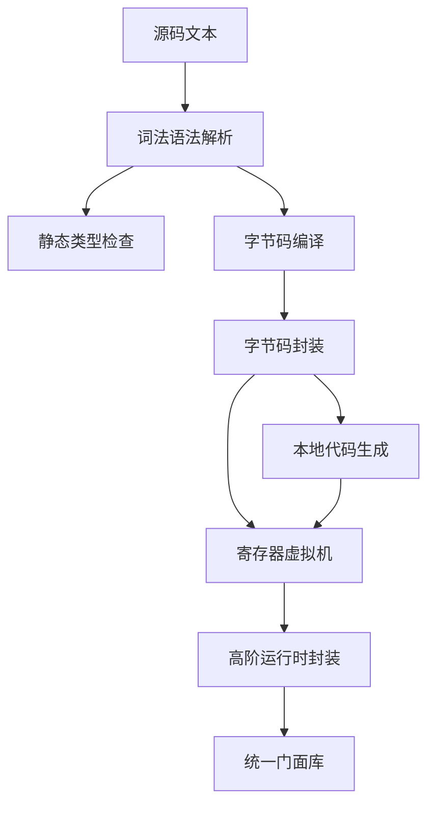

# ulua

ulua 是 [Luau](https://luau.org) 的 Rust 实现。

本项目是基于 [luau-rs/luau](https://github.com/luau-rs/luau) 的全面重构。上游 [luau-rs/luau](https://github.com/luau-rs/luau) 将 Roblox 的 C++ 源码 [luau-lang/luau](https://github.com/luau-lang/luau) 转写为了 Rust。

在此基础上，本项目进行了深度重构与代码现代化：
- **删除所有 `allow`**：彻底清理所有编译警告忽略属性（`#![allow(...)]`），直面并解决潜在隐患；
- **Rust 惯用化重写**：用纯正的 Rust 方式改写 C 风格代码；
- **消除 Clippy 告警**：遵循严格规范，全面避免并修复 Clippy 报警；
- **精简 `unsafe`**：大幅减少 `unsafe` 代码块，持续强化内存安全。

## 项目功能介绍

ulua 将 Luau 语言由 C++ 直接转译至 Rust，无需外部动态链接库绑定或 C 语言编译环境。

项目覆盖完整的语言处理管线：词法分析、语法解析、字节码编译、寄存器虚拟机执行、双向静态类型推导以及底层机器码生成。

除提供语义对齐的底层执行引擎外，ulua 实现了安全易用且内存受控的高阶宿主嵌入层，支持跨语言生命周期管理、恐慌隔离与浏览器端 WebAssembly 运行环境。

## 使用演示

### 基础脚本执行

通过全局便捷函数快速执行脚本与编译字节码：

```rust
use ulua::{compile, eval};

fn main() -> Result<(), Box<dyn std::error::Error>> {
  eval("assert(1 + 1 == 2)")?;

  let bytecode = compile("return 10 * 20")?;
  assert!(!bytecode.is_empty());

  Ok(())
}
```

### 静态类型检查

在脚本运行前执行静态类型推导与契约校验：

```rust
use ulua::{check, check_with_definitions};

fn main() {
  let valid_script = "local total: number = 42";
  assert!(check(valid_script).is_ok());

  let host_script = "local res = add(10, 20)";
  let defs = "declare function add(a: number, b: number): number";
  assert!(check_with_definitions(host_script, defs).is_ok());
}
```

### 高阶宿主嵌入

向脚本环境注册原生数据结构、闭包与成员方法：

```rust
use ulua::prelude::*;

struct Player {
  name: String,
  score: i64,
}

impl UserData for Player {
  fn add_methods<M: UserDataMethods<Self>>(methods: &mut M) {
    methods.add_method("get_score", |_, this, ()| Ok(this.score));
    methods.add_method_mut("add_score", |_, this, points: i64| {
      this.score += points;
      Ok(())
    });
  }
}

fn main() -> Result<()> {
  let lua = Lua::new();

  lua.globals().set("multiplier", 2i64)?;

  let calc = lua.create_function(|_, (a, b): (i64, i64)| Ok((a + b) * 2))?;
  lua.globals().set("calc", calc)?;

  let res: i64 = lua.load("return calc(3, 4)").eval()?;
  assert_eq!(res, 14);

  let player = lua.create_userdata(Player {
    name: "Player1".to_string(),
    score: 100,
  })?;
  lua.globals().set("player", player)?;

  lua.load("player:add_score(50)").exec()?;
  let final_score: i64 = lua.load("return player:get_score()").eval()?;
  assert_eq!(final_score, 150);

  Ok(())
}
```

## 特性介绍

- 纯粹架构实现：脱离 C 与 C++ 工具链依赖，支持静态编译与交叉编译，原生适配 WebAssembly。
- 安全宿主封装：提供符合资源获取即初始化原则的句柄封装，全面接管状态机、表结构、函数及用户数据的生命周期。
- 严谨静态类型：内建双向类型推导求解引擎，支持外部声明定义文件与结构化行列诊断信息。
- 完善恐慌隔离：捕获回调内部发生的运行时恐慌与错误，将其转换为可捕获的脚本运行时错误，避免进程意外终止。
- 编译期静态校验：借助过程宏在编译 Rust 代码时提前对内嵌脚本及模块依赖拓扑进行语法与类型校验。
- 异步与序列化支持：无缝对接异步运行时协程调度系统，结合数据序列化框架实现跨语言数据互通。

## 设计思路

系统各功能模块分工协作，调用流转如下：



解析子系统将脚本源码转换为内存池分配的语法树结构。

类型检查器遍历语法树，结合环境定义执行双向类型推断与约束求解。

编译器处理语法树节点，实施常量折叠与寄存器分配，输出字节码指令序列。

寄存器虚拟机载入字节码，配合分代垃圾回收机制与标准库模块驱动执行。

高阶运行时以安全句柄包装虚拟机底层状态，处理引用计数与跨边界类型转换。

## 技术堆栈

- 开发语言：Rust 2024 版本。
- 兼容基准：Luau 0.737 规范标准。
- 核心层次：
  - `ulua-ast`：词法解析器、语法分析器、内存池以及抽象语法树定义。
  - `ulua-compiler`：字节码编译器与多轮优化过程。
  - `ulua-bytecode`：指令格式定义、编码器与解码器。
  - `ulua-vm`：寄存器虚拟机、内存分配器、垃圾回收器及内置标准库。
  - `ulua-analysis`：双向类型推导引擎、约束求解器与子类型校验器。
  - `ulua-code-gen`：面向主流硬件架构的机器码即时编译引擎。
  - `ulua-rt`：符合人体工程学的安全运行时封装、用户数据绑定与异常桥接。
  - `ulua-config`：层级配置文件解析器。
  - `ulua-require`：字符串路径模块加载与别名解析器。
- 周边生态：
  - `wasm-bindgen`：浏览器环境绑定支持。
  - `rustyline`：交互式命令行输入处理。
  - `serde`：数据序列化与反序列化桥梁。

## 目录结构

```
ulua/
├── crates/
│   ├── ulua/                  # 统一门面入口
│   ├── ulua-analysis/         # 静态类型检查系统
│   ├── ulua-analyze-cli/      # 静态类型检查命令行工具
│   ├── ulua-ast/              # 词法与语法分析器
│   ├── ulua-ast-cli/          # 语法树查看命令行工具
│   ├── ulua-bytecode/         # 字节码定义与编解码
│   ├── ulua-bytecode-cli/     # 字节码查看命令行工具
│   ├── ulua-cli-lib/          # 命令行通用基础库
│   ├── ulua-cli-test/         # 命令行集成测试套件
│   ├── ulua-code-gen/         # 本地代码生成引擎
│   ├── ulua-common/           # 共享数据结构与标志位
│   ├── ulua-compile-cli/      # 字节码编译命令行工具
│   ├── ulua-compiler/         # 字节码编译器与优化器
│   ├── ulua-config/           # 配置文件解析模块
│   ├── ulua-conformance/      # 上游符合性测试套件
│   ├── ulua-e2e/              # 端到端测试框架
│   ├── ulua-reduce-cli/       # 脚本精简命令行工具
│   ├── ulua-repl-cli/         # 交互式解释器命令行工具
│   ├── ulua-require/          # 字符串模块路径解析
│   ├── ulua-rt/               # 高阶安全运行时抽象
│   ├── ulua-checked-macros/   # 编译期类型检查过程宏
│   ├── ulua-rt-derive/        # 派生宏实现
│   ├── ulua-unit-test/        # 单元测试集合
│   ├── ulua-vm/               # 寄存器虚拟机与标准库
│   └── ulua-web/              # 浏览器运行环境集成
├── examples/                  # 示例工程集合
├── cpp/                       # 上游 Luau 源码子模块
├── docs/                      # 架构设计与技术文档
└── readme/                    # 双语主干说明文档
```

## API 说明

### 顶层辅助函数

- `compile(source: &str) -> Result<Vec<u8>, String>`：编译 Luau 脚本源码为底层二进制字节码切片。
- `eval(source: &str) -> Result<(), String>`：创建隔离的虚拟机实例，加载标准库并执行脚本，返回执行状态。
- `check(source: &str) -> Result<(), Vec<TypeDiagnostic>>`：执行静态类型检查，若存在类型错误则返回详细诊断信息。
- `check_with_definitions(source: &str, defs: &str) -> Result<(), Vec<TypeDiagnostic>>`：结合预设类型声明定义对源码进行静态校验。
- `check_modules(...)` / `check_modules_with_definitions(...)`：在模块依赖树中批量校验相互引用的多个脚本。

### 过程宏

- `ulua!`：在 Rust 编译阶段对内嵌脚本进行语法与静态类型合规性校验。
- `ulua_file!`：在编译期对指定路径文件及其依赖模块图实施类型校验。

### 核心运行时类型与特征

- `Lua`：虚拟机核心控制句柄，管理运行状态生命周期、全局环境及对象分配。
- `Table`：脚本表结构操作句柄，提供键值读写、迭代遍历与顺序数组访问接口。
- `Function`：可执行函数句柄，支持多参数传参与结果解构。
- `UserData`：允许将宿主自定义结构体安全暴露至脚本环境的核心特征。
- `UserDataMethods`：方法注册器，用于挂载只读方法、可变修改方法以及元方法。
- `Value`：动态值枚举，涵盖所有有效的语言数据表现形态。
- `Chunk`：待执行脚本块封装，提供求值、执行及静态检查功能。
- `FromLua` / `IntoLua`：定义宿主与虚拟机环境之间的数据类型转换规范。
- `TypeDiagnostic`：结构化类型诊断对象，记录行号、列号与违规描述。
- `Error` / `Result`：统一错误结果集，涵盖语法解析、虚拟机执行及类型约束失败。
